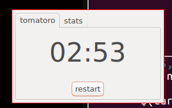

# Boxcar Willie


This is a pomodoro timer and a port of [tomaty](https://github.com/ejmg/tomaty). I wrote this to motivate learning more Rust and GTK3.

Here's what it looks like on my machine:



To install,

```
$ cargo install
```

Then it should be in `~/.local/bin` or your operating system's equivalent.
